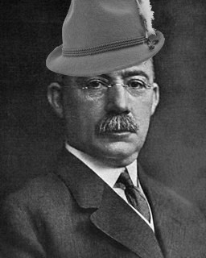

# Gantenzell

    1. Measure activities by the amount of time needed to complete them;
    2. The space on the chart can be used to represent the amount of the activity that should have been done in that time.
    
[Henry Gantt](https://en.wikipedia.org/wiki/Henry_Gantt) - [Organizing for Work](https://archive.org/details/organizingforwor00gant), 1919

